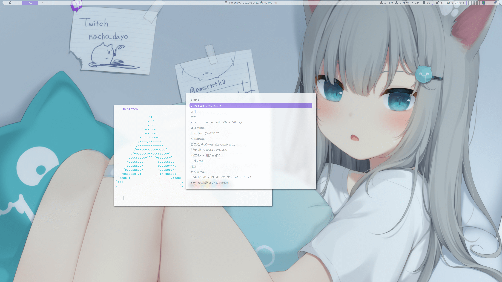

# VIOLET OS

## Sceenshot


🎨 This is my violet color theme for **i3 window manager,picom, polybar, rofi, kitty**

## Install
> ⚠️ Please **backup your configuration** before installing

Configuration based on Gnu Stow
### example
```bash
# install kitty config
stow kitty
```
